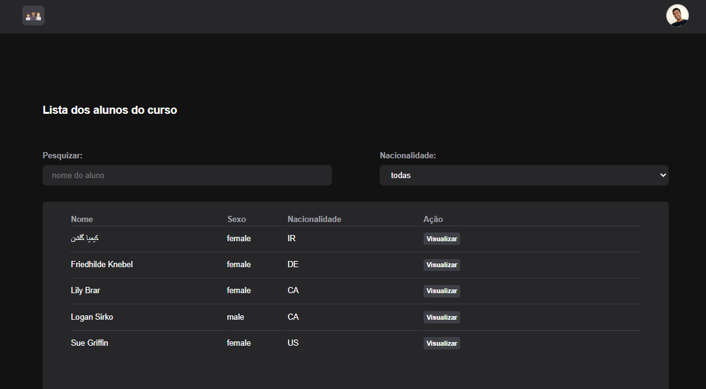

<h1 align="center" style="color: rgb(255, 106, 7)"> Projeto React StackX </h1>

<h3 align="center"> Meu Segundo Projeto em react, como aluno da StackX.</h3>

 
            

 

## :writing_hand: descrição:
* Nesse projeto através da API e posivel buscar usuarios pelo Nome, ou pela sua nacionalidade.
Foram aplicados muitos dos fundamentos de React nesse Projeto.

## :gear:Tecnologias

* Este projeto contem conceitos iniciais em React, com as seguintes tecnologias:

  - [ ReactTS ](https://reactjs.org/)
  - [Vite](https://vitejs.dev/guide/)
  - [Componentes estilizados](https://styled-components.com/)

 

* E esses conceitos:
  
    - Adereços
    - Componente
    - Módulos
    - Estrutura da Estrutura
    - ganchos
    - Estado
    - Solicitação à API

 

  ### " ... Aprender é a única coisa de que a mente nunca se cansa, nunca tem medo e nunca se arrepende ...." 